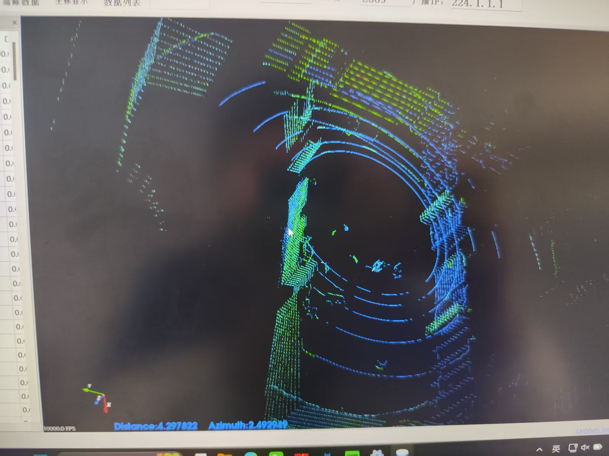
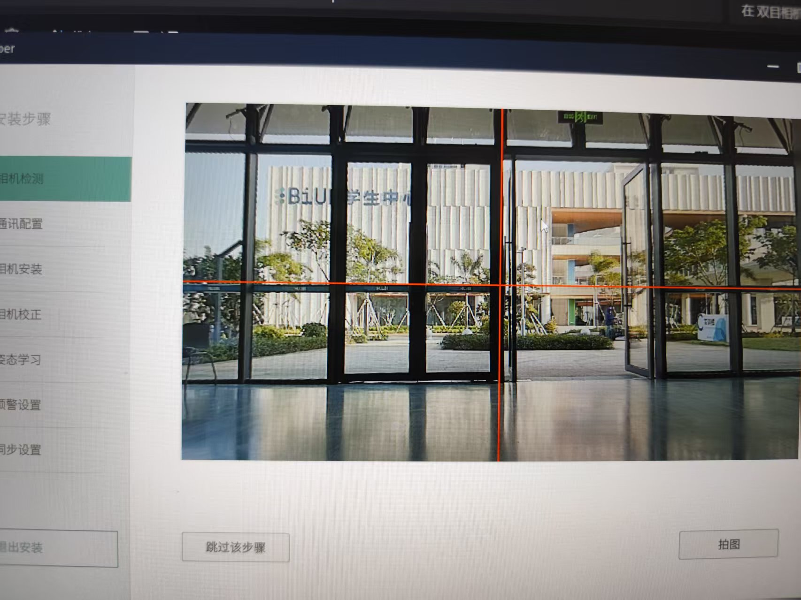
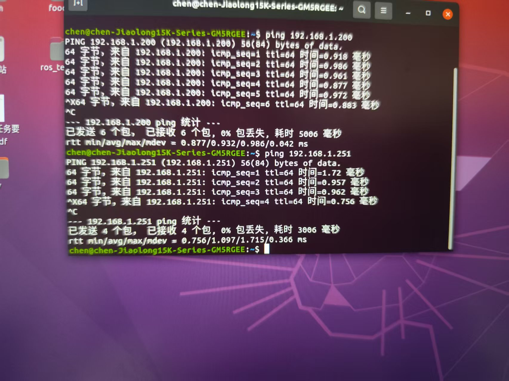

# #week6 实验报告

### 1. 实验任务

本周任务主要围绕车辆传感器的初步检测与底层通讯巡检展开：

* **Windows 上位机初步检测**：通过 LSLIDAR 和 FieldHelper 工具验证激光雷达与双目相机的数据状态。
* **宿主机底层通讯巡检**：在 Ubuntu 环境下验证 CAN 总线数据及各传感器的网络连通性。
* **传感器参数核验**：确认激光雷达点云覆盖范围及相机图像流的稳定性。

---

### 2. 实现过程

> **步骤一：环境准备与静态 IP 设置**
> 在开始检测前，首先确保笔记本电脑通过网线接入系统网络，并将本地静态 IP 手动设置为 `192.168.1.102`，关闭防火墙。

> **步骤二：Windows 上位机传感器检测**

1. **激光雷达 (LiDAR)**：打开 LSLIDAR 上位机并连接。观察到实时点云能够稳定覆盖 360° 环境。

2. **双目相机 (Camera)**：连接设备（IP: `192.168.1.251`），通过 FieldHelper 登录。确认左、右目视野成像正常，无黑屏或明显卡顿

> **步骤三：Ubuntu 宿主机底层通讯验证**
  在终端执行底层指令查看 CAN 流量，并分别对激光雷达和相机进行 Ping 测试，均无异常

---

### 3. 遇到的问题及解决

> **问题一：物理链路连接困惑**

* **现象**：在连接上位机前，面对设备箱内众多的线缆，无法准确分辨哪一根是用于通讯的网线。
* **解决**：通过逐一排查接口类型，并比对线缆标签，最终确认了连接工控机网络的以太网线，成功建立了物理连接。

> **问题二：工控机硬件故障**

* **现象**：本周由于工控机故障，导致部分基于 Docker 的高层应用调试无法开展。
* **解决**：调整实验重心，先完成 Windows 端的工具检测及宿主机的底层通讯巡检，确保传感器本身处于正常状态。

---

### 4. 总结与心得

本周的实验虽然受限于硬件故障，但在对传感器进行初步检测的过程中，直观地感受到了激光雷达的点云成像效果，对雷达的探测范围和精度有了感性认识。
这也引发了对后续算法设计的思考：在设计导航路径规划时，可以充分结合雷达的视野特点（如盲区位置、有效探测距离等）来优化避障策略。底层的通讯巡检虽然繁琐，但它是自动驾驶系统稳定的基石，只有确保了像 CAN 总线和网络链路这些“神经系统”的通畅，后层的感知和决策算法才能有效运行。各项工作进展顺利，无疑问。